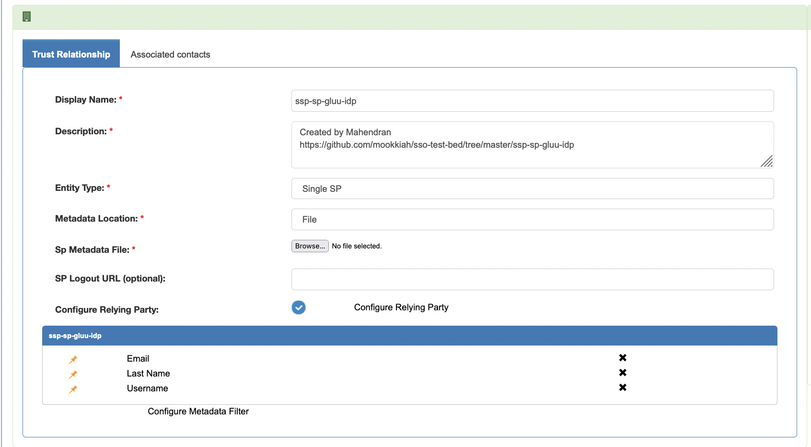
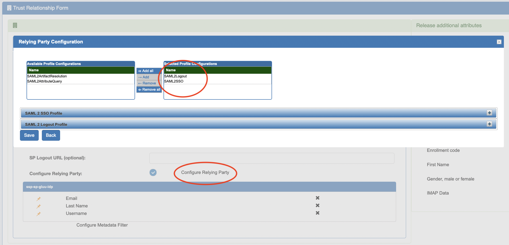
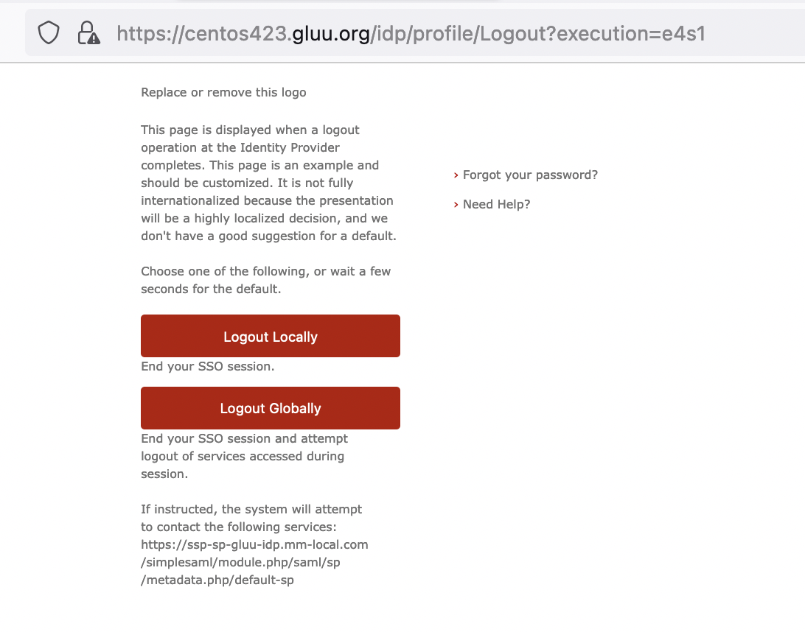
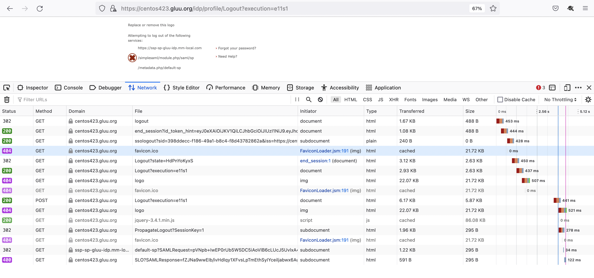
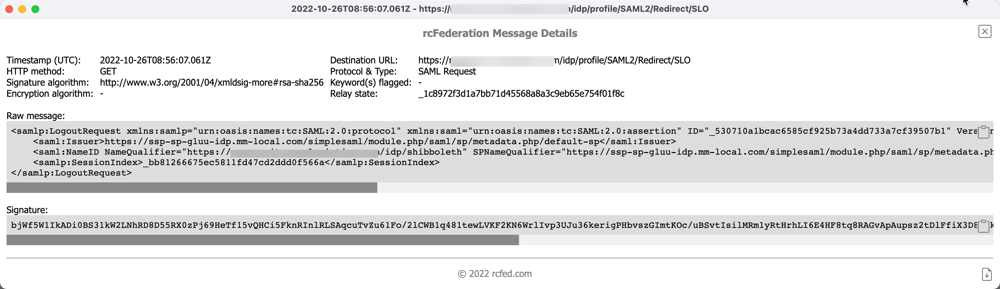
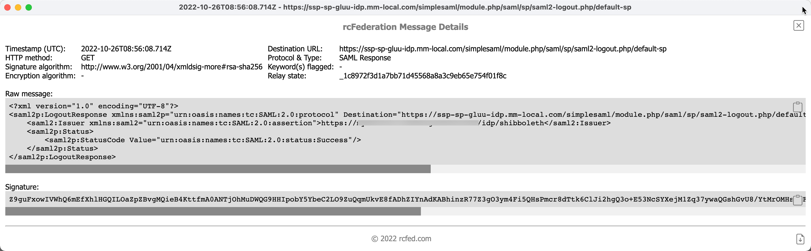
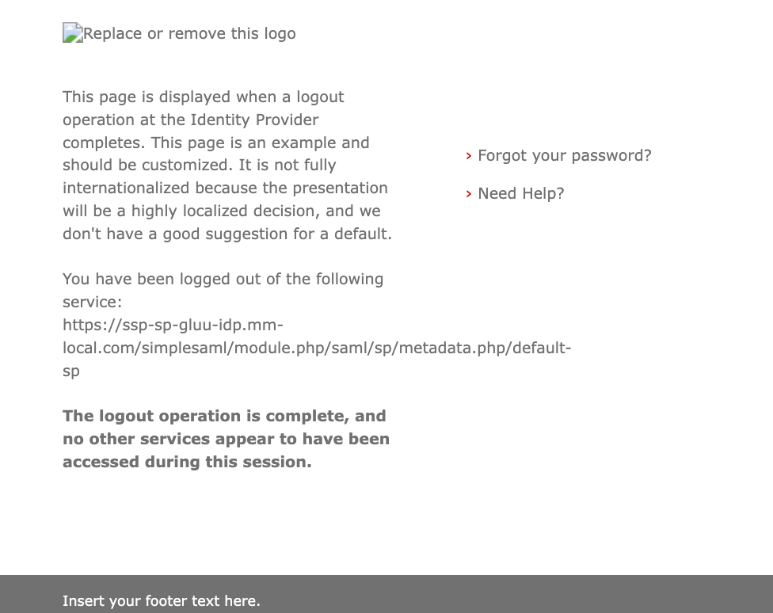
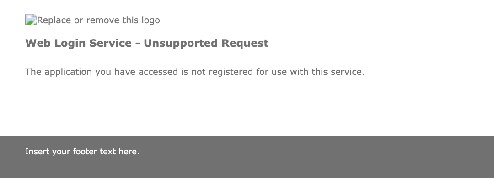

Thanks to Zico@Gluu for providing an environment to experiment and document the outcome in my blog.

Gluu should be configured to accept Logout request in "Relying Party Configuration"





For IDP initiated logout, visit this url,

https://centos423.gluu.org/idp/Authn/oxAuth/logout

ends up in a page

https://centos423.gluu.org/idp/profile/Logout?execution=e2s1





The Red X mark actually representing  like a list item not a failure.

See [IDP log](other/shibboleth-idp-process.log)


During SP initiated logout, SP sends logout request with signature








## What is not working
- SP initiated logout when logout clicked from SimpleSAMLphp application
- This may be the same reason Gluu is returing 400 response code on the last call during Global Logout (GLO)


## Troubleshooting
### Missing RP Logout setup
If we dont properly setup "Relying Party configuration" to enable logout, we will see error like this in IDP log when SAML LogoutRequest received
```
2022-10-26 08:23:34,331 - 192.168.122.1 - WARN [net.shibboleth.idp.profile.impl.SelectProfileConfiguration:118] - Profile Action SelectProfileConfiguration: Profile http://shibboleth.net/ns/profiles/saml2/logout is not available for RP configuration EntityNames[https://ssp-sp-gluu-idp.mm-local.com/simplesaml/module.php/saml/sp/metadata.php/default-sp,] (RPID https://ssp-sp-gluu-idp.mm-local.com/simplesaml/module.php/saml/sp/metadata.php/default-sp)
2022-10-26 08:23:34,332 - 192.168.122.1 - WARN [org.opensaml.profile.action.impl.LogEvent:101] - A non-proceed event occurred while processing the request: InvalidProfileConfiguration
```

### Missing Signing certificate in SP Metadata:

When SP metadata does not contain the sign certificate and IDP is configured to verify signature (by default), Logout process will result into below error screen


Workaround - Bad Security Practice:
When SP is not able to sign the logout request, We can ask IDP to allow unauthenticated Logout request by setting `idp.logout.authenticated=false` in /opt/shibboleth-idp/conf/idp.properties
Reference: https://shibboleth.atlassian.net/wiki/spaces/IDP4/pages/1265631719/LogoutConfiguration
